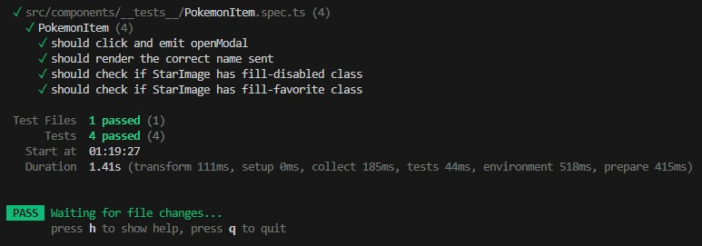

# Challenge Global66 

## ⛏️ Built Using

- [VueJS + Vite](https://vitejs.dev/guide/#scaffolding-your-first-vite-project) - The Progressive JavaScript Framework + Next Generation Frontend Tooling
- [Tailwind](https://tailwindcss.com) - A utility-first CSS framework packed
- [Node.js](https://nodejs.org) - JavaScript engine
- [TypeScript](https://www.typescriptlang.org) - TypeScript is a strongly typed programming language that builds on JavaScript, giving you better tooling at any scale
- [Pinia](https://pinia.vuejs.org) - The intuitive store for Vue.js
- [Axios](https://github.com/axios/axios) - Promise based HTTP client for the browser and node.js
- [Vitest](https://vitest.dev) - A Vite-native testing framework
- [Vue.js devtools](https://chromewebstore.google.com/detail/vuejs-devtools/nhdogjmejiglipccpnnnanhbledajbpd) - Chrome DevTools extension for debugging Vue.js applications.

---

## 🏁 Getting Started

### Prerequisites:

Install **Git**: [https://git-scm.com/book/en/v2/Getting-Started-Installing-Git](https://git-scm.com/book/en/v2/Getting-Started-Installing-Git)

Install **Node**: [https://nodejs.org/](https://nodejs.org/)

---

## Project clone

```
git clone https://github.com/dejota/challenge-pokeapi.git

cd challenge-pokeapi
```

## Project setup

```
npm install
```

### Compiles and hot-reloads for development

```
npm run dev
```

### View on browser

```
http://localhost:5173
```

### Compiles and minifies for production

```
npm run build
```

### Run tests

```
npm run test
```

### Result



---

## ✍️ Author

- [Juan Carlos Quintero](https://www.linkedin.com/in/quinterojuan)

<br>


